# Sentiment Analysis 


Credits: [Bairs Dev Blog](https://www.bairesdev.com/blog/best-python-sentiment-analysis-libraries/)

<a href="https://www.python.org/">
    
</a>
<a href="https://pandas.pydata.org/">
    
</a>
<a href="https://numpy.org/">
    
</a>
<a href="https://matplotlib.org/">
    
</a>
<a href="https://seaborn.pydata.org/">
    
</a>
<a href="#">
    
</a>
<a href="https://www.nltk.org/">
    
</a>
<a href="https://github.com/stanfordnlp/GloVe">
    
</a>
<a href="https://huggingface.co/transformers/">
    
</a>
<a href="https://www.tensorflow.org/">
    
</a>
<a href="https://keras.io/">
    
</a>
<a href="https://scikit-learn.org/stable/">
    
</a>
<a href="https://huggingface.co/">
    
</a>

**Project description:** This project aims to classify Amazon product reviews into positive and negative sentiments using advanced machine learning techniques, including Long Short-Term Memory (LSTM) networks, GloVe embeddings, and fine-tuning a pre-trained DistilBERT model.

---

## Background: What Is Sentiment Analysis and What Can It Be Used For ?

The advent of e-commerce has generated an enormous volume of user-generated content in the form of reviews. Sentiment analysis, a branch of natural language processing (NLP), enables businesses to gauge customer sentiment from these reviews.

#### Key Importance of Sentiment Analysis
- 1. Enhanced Decision Making

Organizations leverage sentiment analysis to gauge public opinion, leading to informed decision-making. By understanding customer sentiment, businesses can refine their products, services, and marketing strategies.

- 2. Competitive Advantage

Analyzing competitors’ customer feedback can provide valuable insights into market trends, helping businesses to stay ahead in their industries.

- 3. Brand Management

Sentiment analysis aids in monitoring brand reputation by analyzing customer reviews and social media mentions. Timely identification of negative sentiments allows companies to address issues proactively.

#### Some Real Business Use Cases of Sentiment Analysis

- Social Media Monitoring

- Customer Feedback Analysis

- Market Research

- Political Analysis

- Crisis Management

---
# The Process 
  ## 1. Data Acquisition
### The Amazon Review Dataset (Hugginface Hub)


Credits: [Entrepreneur](https://www.entrepreneur.com/business-news/the-amazon-effect-how-ecommerce-will-change-in-2019-and/325556)
  
#### Dataset Summary
The Amazon reviews dataset consists of reviews from amazon. The data span a period of 18 years, including ~35 million reviews up to March 2013. Reviews include product and user information, ratings, and a plaintext review.

#### Supported Tasks and Leaderboards
text-classification, sentiment-classification: The dataset is mainly used for text classification: given the content and the title, predict the correct star rating.

#### Languages
Mainly English.

#### Dataset Structure
Data Instances
A typical data point, comprises of a title, a content and the corresponding label.

An example from the AmazonPolarity test set looks as follows:
```
{
    'title':'Great CD',
    'content':"My lovely Pat has one of the GREAT voices of her generation. I have listened to this CD for YEARS and I still LOVE IT. When I'm in a good mood it makes me feel better. A bad mood just evaporates like sugar in the rain. This CD just oozes LIFE. Vocals are jusat STUUNNING and lyrics just kill. One of life's hidden gems. This is a desert isle CD in my book. Why she never made it big is just beyond me. Everytime I play this, no matter black, white, young, old, male, female EVERYBODY says one thing ""Who was that singing ?""",
    'label':1
}
```

Data Fields
```
'title': a string containing the title of the review - escaped using double quotes (") and any internal double quote is escaped by 2 double quotes (""). New lines are escaped by a backslash followed with an "n" character, that is "\n".
'content': a string containing the body of the document - escaped using double quotes (") and any internal double quote is escaped by 2 double quotes (""). New lines are escaped by a backslash followed with an "n" character, that is "\n".
'label': either 1 (positive) or 0 (negative) rating.
```

The data can be accessed on directly through our code

```
from datasets import load_dataset

amazon_train = load_dataset('amazon_polarity', split='train[:10000]')
amazon_test = load_dataset('amazon_polarity', split='test[:1000]')
```
Additionally here is the link [AmazonReviewsHuggingFaceHub](https://huggingface.co/datasets/fancyzhx/amazon_polarity)

### GloVe Embeddings 
Download The GloVe embeddings from here as well [Glove Embeddings](https://github.com/stanfordnlp/GloVe)

And download glove.twitter.27B which is what we use for our use case


---
## 2. Data Preprocessing and Preparation
 This step contains various steps in order to utlize our text for our sentiment analysis tasks. They are as follows:
### 2.1 Normalize and Remove Special Characters:

This step involves converting text to a consistent format (e.g., lowercasing) and removing unwanted characters (e.g., punctuation, symbols) to reduce noise in the data.

### 2.2 Tokenize Text:

Tokenization splits the text into individual words or tokens, which are the building blocks for further analysis and modeling.

### 2.3 Remove Stopwords:

Stopwords (common words like "the", "is", "in") are often removed because they do not contribute significant meaning to the context of the text, helping to focus on more meaningful words.

### 2.4 Lemmatize Words:

Lemmatization reduces words to their base or root form (e.g., "running" to "run"), which helps in treating different forms of a word as the same token and reduces dimensionality.

```
def preprocess_text(text):
    # Normalize and remove special character
    text = text.lower()
    text = re.sub('[^0-9a-zA-Z]', ' ', text)
    # Tokenize text
    words = word_tokenize(text)
    # Remove stopwords
    stop_words = set(stopwords.words('english'))
    words = [word for word in words if word not in stop_words]
    # Lemmatize words
    lemmatizer = WordNetLemmatizer()
    words = [lemmatizer.lemmatize(word) for word in words]
    # Join words back into a sentence
    text = ' '.join(words)
    return text
```
### 2.5 Define Preprocessing Variables

```
vocab_size = 25500
max_length = 100
trunc_type = 'post'
padding_type = 'post'
oov_token = ''
embedding_dim = 25
```
**Explanation of Variables**

- vocab_size: Limits the vocabulary size to manage complexity and improve training efficiency.

- max_length: Ensures all sequences are of uniform length, which is crucial for batch processing in neural networks.

- trunc_type: Defines how to handle sequences longer than max_length, ensuring consistency in input shape.

- padding_type: Specifies where to add padding to sequences, which is important for maintaining the structure of data.

- oov_token: Handles words not in the vocabulary, preventing potential errors during training.

- embedding_dim: Determines the size of the embedding vectors, impacting the model's ability to capture semantic relationships without excessive computational load.

---
## 3. Visualization and Word Cloud

In this step, we will look at how the data is distributed

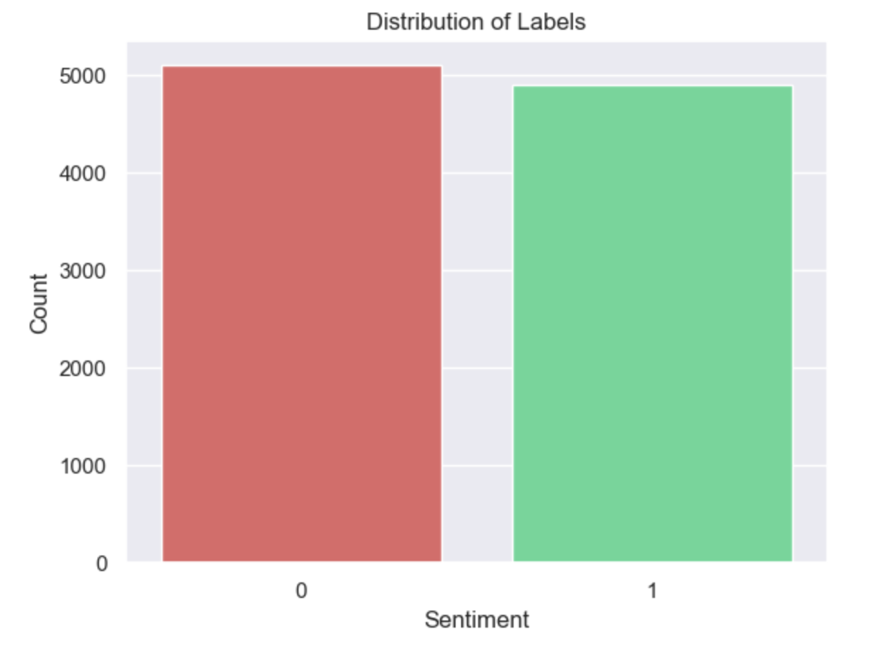
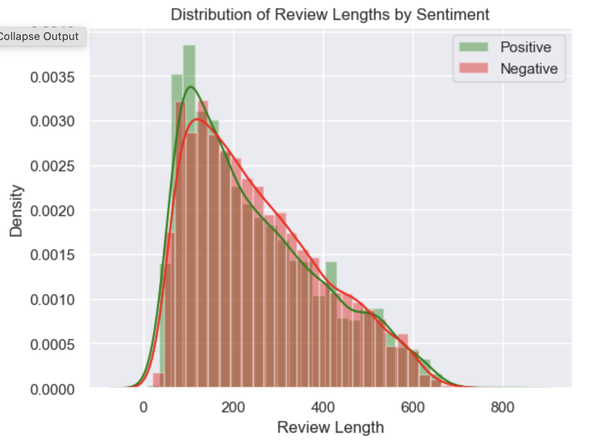
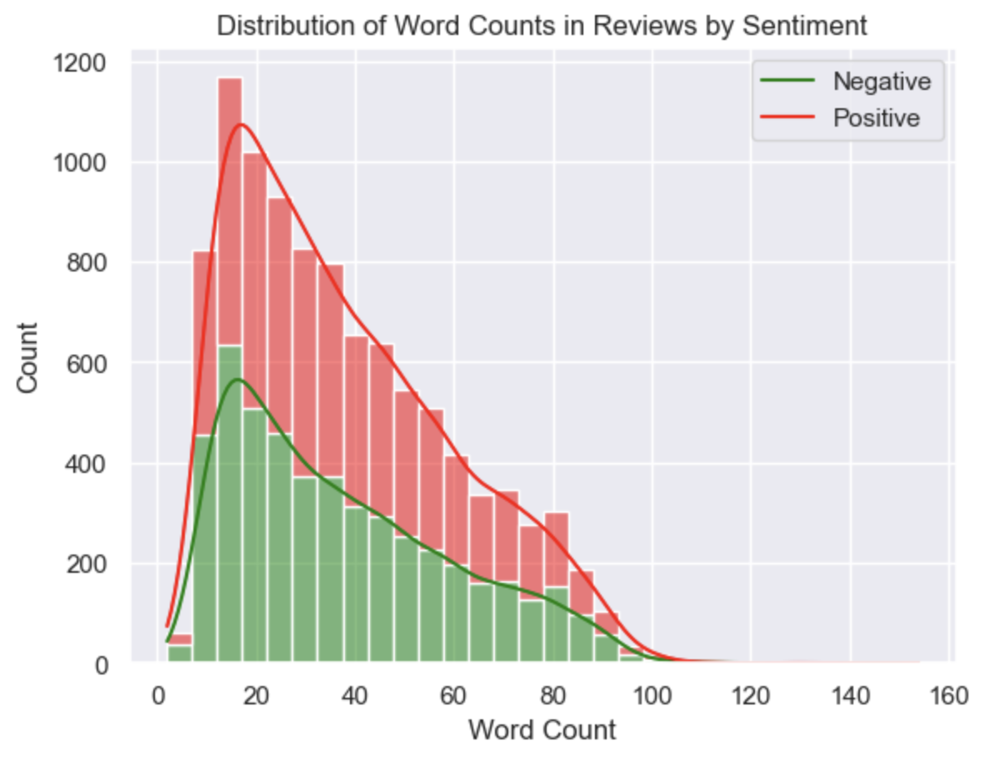

Further, we will also look at the Word Cloud overall then for individual labels
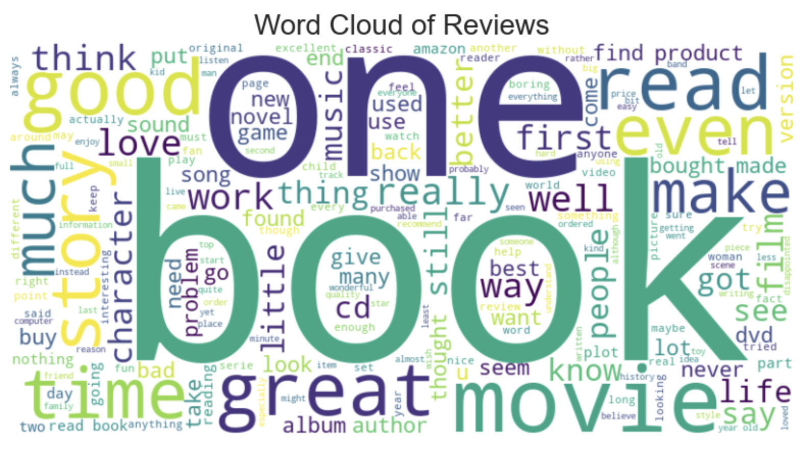
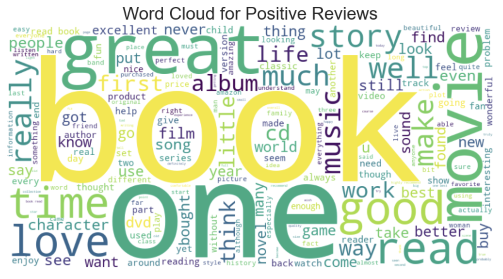
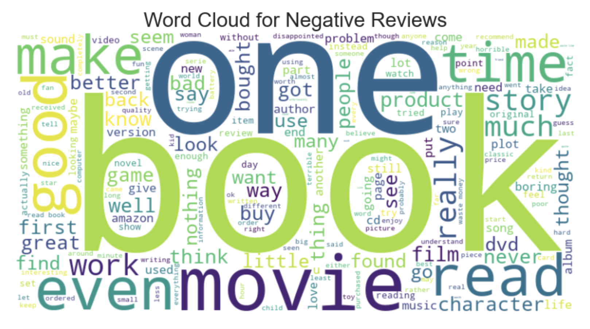
--- 

## 4. Sentiment Analysis with LSTM and Glove

** Why LSTM (Long Short-Term Memory Networks)?**

- Handling Sequential Data:

LSTMs are designed to work with sequences of data, making them particularly effective for text data where the order of words matters. They can remember previous inputs and use that information to influence the output, which is crucial for understanding context in sentiment analysis.
Mitigating the Vanishing Gradient Problem:

Traditional recurrent neural networks (RNNs) often struggle with long sequences due to the vanishing gradient problem, where gradients become too small for the model to learn effectively. LSTMs use a unique gating mechanism that allows them to retain and forget information, enabling them to capture long-range dependencies in text.

- Enhanced Performance:

LSTMs have been shown to outperform traditional machine learning models and simple RNNs in various NLP tasks, including sentiment analysis. Their ability to model complex patterns in data makes them a powerful choice for this task.

**Why GloVe (Global Vectors for Word Representation)?**

- Pre-trained Word Embeddings:

GloVe provides pre-trained embeddings that capture the semantic meaning of words based on their context in a large corpus. Using these embeddings helps the LSTM model start with a good understanding of word relationships, reducing the need for extensive training from scratch.

- Efficient Representation:

GloVe embeddings represent words as dense vectors in a lower-dimensional space, which helps in capturing the similarities between words based on their co-occurrence in the dataset. This efficient representation allows the LSTM model to focus on learning patterns in the data rather than the intricacies of raw text.

- Improved Generalization:

By using GloVe embeddings, the model can generalize better to unseen data. Since GloVe is trained on a large corpus, it contains knowledge about various words and their relationships, which can enhance the model's ability to infer sentiment from text it has not explicitly seen before.

Thus, by combining LSTM with GloVe embeddings leverages the strengths of both: LSTMs effectively model sequential dependencies in text data, while GloVe provides rich, pre-trained semantic representations of words. This combination can lead to better performance in sentiment analysis tasks, capturing nuanced meanings and contextual relationships that are essential for understanding sentiment in textual data.

Reference From Medium [Sentiment Analysis — using LSTM & GloVe Embeddings](https://medium.com/@skillcate/sentiment-classification-using-neural-networks-a-complete-guide-1798aaf357cd)

### Model Architecture

```
model = tf.keras.Sequential([
    tf.keras.layers.Embedding(vocab_size, embedding_dim,
        weights=[embedding_matrix], trainable=False),
    tf.keras.layers.Bidirectional(tf.keras.layers.LSTM(150, return_sequences=True)),
    tf.keras.layers.Bidirectional(tf.keras.layers.LSTM(150)),
    tf.keras.layers.Dense(64, activation='relu'),
    tf.keras.layers.Dense(1, activation='sigmoid')
])
```

### Model Training

We train the LSTM model with different configurations and use polynomial decay for a learning rate scheduler with the Adam optimizer. Callbacks including early stopping, model checkpoint, and tensorboard are used.

```
# Compile the model
model.compile(loss=tf.keras.losses.BinaryCrossentropy(),
            optimizer=optimizer, 
            metrics=['accuracy']
)

# Define callbacks
early_stopping = EarlyStopping(monitor='val_loss', patience=5, restore_best_weights=True)
model_checkpoint = ModelCheckpoint('../models/lstm/best_model.h5', monitor='val_loss', save_best_only=True)
tensorboard_callback = TensorBoard(log_dir='./logs', histogram_freq=1)

# Train the model
history = model.fit(
    train_padded,
    train_labels,
    validation_data=(test_padded, test_labels),
    epochs=100,
    callbacks=[early_stopping, model_checkpoint, tensorboard_callback])
```
### Evaluation and Results

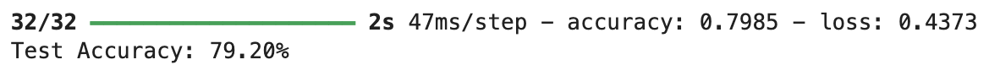

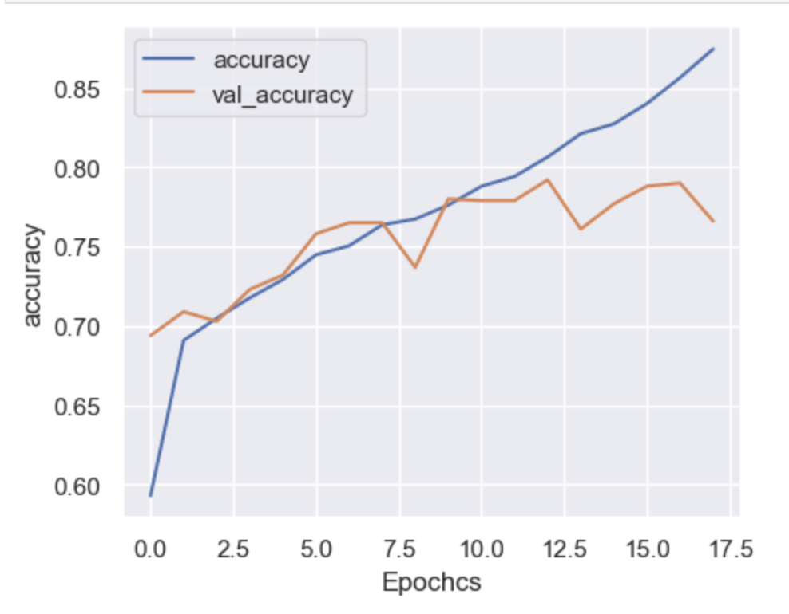
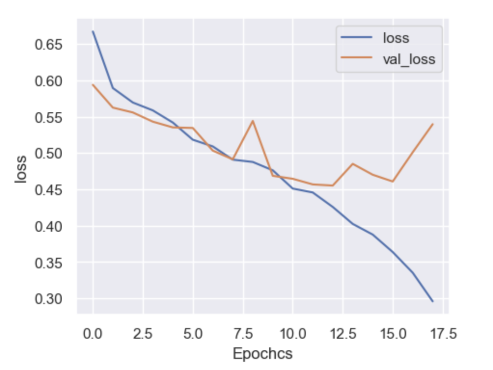
The model begins to diverge around 9 epochs luckily, using our ModelCheckpoint callback we were able so save the best performing model.

**Confusion Matrix**
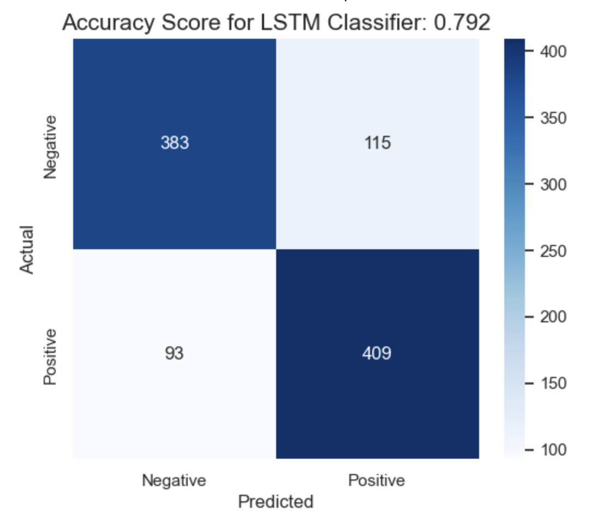

**ROC AUC Curve**
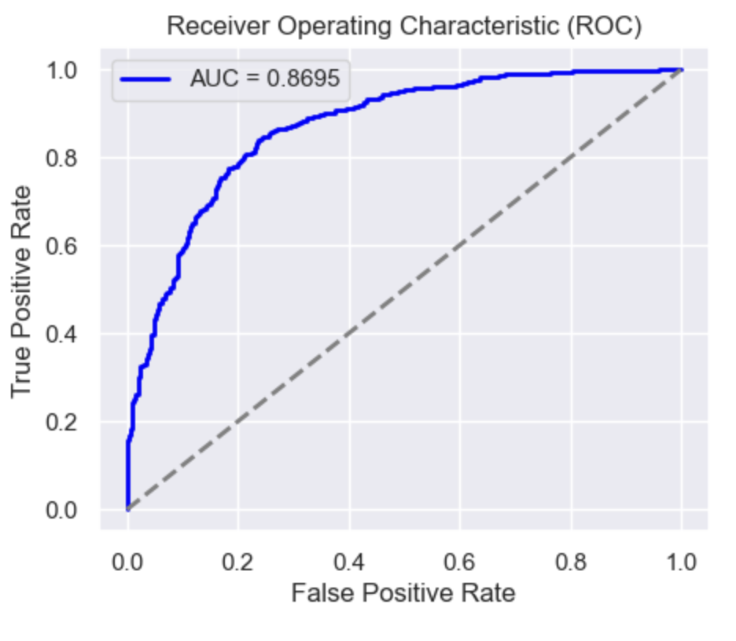

## 4. Sentiment Analysis using DistilBERT
**Why DistilBERT for Sentiment Analysis?**

DistilBERT is a lightweight version of BERT (Bidirectional Encoder Representations from Transformers) and is well-suited for sentiment analysis because of the following reasons:

1. Efficiency and Speed:

DistilBERT is designed to be faster and more efficient than BERT. It reduces the number of parameters and computations by 40% while retaining 97% of BERT's performance. This makes it an excellent choice for sentiment analysis, especially when computational resources are limited or when deploying models in production environments where speed is critical.

2. Bidirectional Contextual Understanding:

Like BERT, DistilBERT uses a bidirectional transformer architecture, meaning it considers both the left and right context of each word in a sentence simultaneously. This bidirectional understanding is crucial for sentiment analysis as the meaning of a word (and hence the sentiment) often depends on surrounding words.

3. Transfer Learning with Pre-trained Models:

DistilBERT is pre-trained on large corpora using masked language modeling, allowing it to learn rich contextual representations of words. For sentiment analysis, fine-tuning a pre-trained DistilBERT model can yield state-of-the-art performance with minimal training data because it already "knows" a lot about language and context.

4. Handling Complex Language Patterns:

Sentiment analysis can involve complex language patterns, such as sarcasm, negations, and subtle shifts in tone. DistilBERT's deep transformer layers excel at capturing these intricacies, allowing the model to discern positive or negative sentiment even in complicated sentence structures.

5. Scalability:

Since DistilBERT is smaller and faster than BERT, it is more scalable for real-time applications or larger datasets. It can handle sentiment analysis tasks at scale without sacrificing much accuracy, making it a great choice for practical deployment in applications like social media monitoring, customer feedback analysis, or product reviews.

DistilBERT combines the strengths of BERT's bidirectional transformer architecture with efficiency, making it an excellent model for sentiment analysis. It captures rich contextual meaning while being faster and more resource-friendly, making it suitable for both research and real-world applications.

Reference Article from Medium [Decoding Emotions: Sentiment Analysis with DistilBERT](https://medium.com/@adityajethani/decoding-emotions-sentiment-analysis-with-distilbert-f7096da29274)

**Fine-tuning DistilBERT**

We fine-tune DistilBERT on the amazon_polarity dataset. The model was trained on google colabs T4 GLU over 3 epochs while utilizing a PolynomialDecay learning rate scheduler.

Loading the Model

```
# Initialize BERT tokenizer and model
model_name = 'distilbert-base-uncased'
tokenizer = DistilBertTokenizer.from_pretrained(model_name)
model = TFDistilBertForSequenceClassification.from_pretrained('../models/fine_tuned_distilbert', num_labels=2)
```
**Model Evaluation**

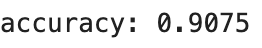

**Example Predictions** 

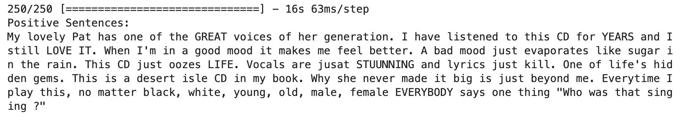
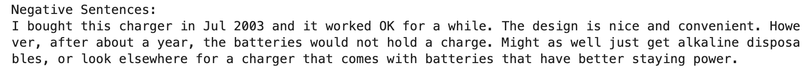

---
## Conclusion
This sentiment analysis project has successfully demonstrated the feasibility and effectiveness of using machine learning models to understand and classify the sentiment expressed in product reviews. The project employed two powerful models, an LSTM model with GloVe embeddings and a fine-tuned DistilBERT model, which achieved impressive accuracies of 79.20% and 90.75%, respectively.

The project's findings have several potential applications. For example, businesses can use sentiment analysis to track customer satisfaction, identify areas for improvement, and develop more effective marketing campaigns. Additionally, consumers can use sentiment analysis to inform their purchase decisions by understanding the overall sentiment towards specific products or services.